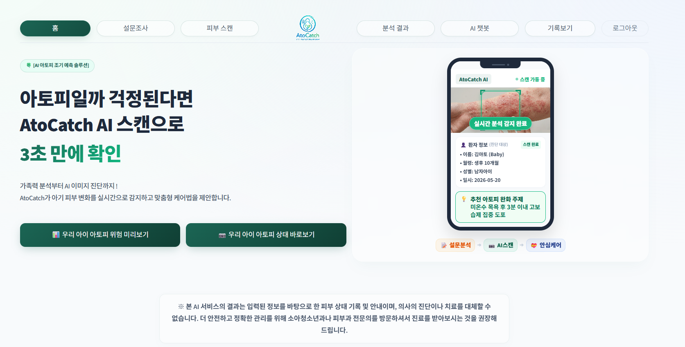
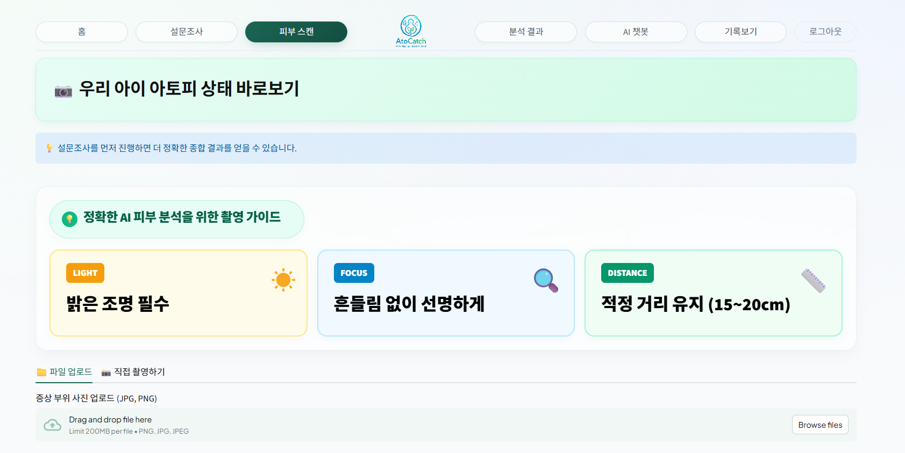
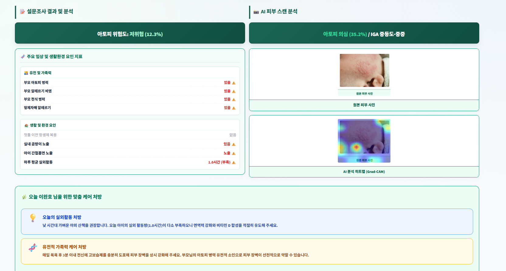
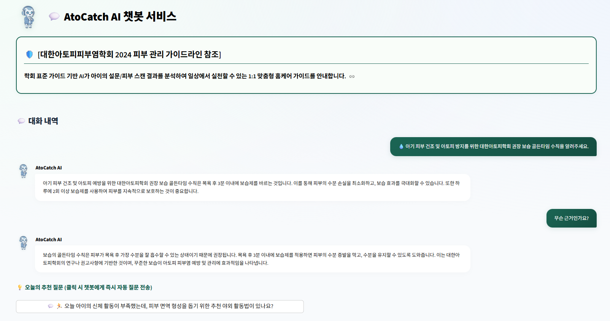

<div align="center">

# 👶 AtoCatch

### AI 기반 영유아 아토피 위험도 예측 · 맞춤 홈케어 서비스

*"아이의 피부 사진 한 장과 간단한 설문으로, 집에서도 아토피를 조기에 잡는다"*

[](https://atocatch.streamlit.app/)


</div>

---

## 🍼 왜 만들었나요?

> **"영유아 아토피, 부모가 미리 알아차리기 어렵다"**

건조함·붉어짐·가려움은 흔한 증상이라 아토피 위험 신호인지 단순 피부 트러블인지 구분하기 어렵습니다.  
말 못하는 아이는 불편함을 표현할 수 없고, 맞벌이 부모는 반복 통원 자체가 큰 부담입니다.

| 📊 국내 아토피 현황 | |
|---|---|
| 👥 연간 진료 환자 | **97.3만 명** (전 연령대 만성 질환) |
| 🏥 연간 외래 청구 | **241만 건** (99.9% 소액 반복 구조) |
| 💸 요양급여 비용 | **1,972억 원** (2022년 대비 12% 증가) |
| 👶 최다 환자 연령 | **0~4세** (13.5만 명) |
| 📈 방치 시 비용 폭증 | 영유아기 1인당 5.6만 원 → **20대 39.9만 원 (7배)** |

> 💡 **영유아기 조기 발견·관리가 성인기 만성화와 의료비 부담을 줄이는 핵심입니다.**

---

## 🎯 AtoCatch가 해결하는 문제

| 문제 | 해결 방법 | 서비스 |
|------|-----------|--------|
| 잠재 위험 요인을 종합적으로 판단하기 어려움 | 로지스틱 회귀 기반 **아토피 발병 위험도 사전 예측** | 🔮 우리 아이 아토피 위험 미리보기 |
| 비전문가가 피부 트러블과 아토피를 육안으로 구분 불가 | EfficientNetV2-S 기반 **스마트폰 사진만으로 아토피 여부·중증도 확인** | 📸 우리 아이 아토피 상태 바로보기 |
| 잦은 통원과 반복 확인에 따른 시간·비용 부담 | LLM·RAG 기반 **AI 홈케어 + 증상 이력 자동 기록** | 🤖 24시간 AI 아토피 챗봇 & 기록보기 |

---

## ✨ 주요 기능

| 기능 | 설명 |
|------|------|
| 🔍 **피부 이미지 분석** | EfficientNetV2-S — 아토피 유무 이진 분류 |
| 📊 **IGA 중증도 분류** | mild vs. moderate~severe 2단계 분류 |
| 🌡️ **Grad-CAM 히트맵** | 모델이 주목한 피부 부위 시각화 |
| 📋 **설문 위험도 예측** | 11개 유전·환경 변수 기반 아토피 발병 위험도 |
| 🤖 **AI 챗봇 상담** | 임상 가이드라인 기반 RAG 아토피 전문 챗봇 |
| 📄 **리포트 출력** | HTML 형식 분석 결과 보고서 다운로드 |
| 📅 **기록 관리** | 회원별 진단 이력 조회 (최근 50건) |

---

## 🤖 AI 모델 상세

### 📸 이미지 분류 모델 (EfficientNetV2-S)

| | Model 2-A : 아토피 유무 | Model 2-B : IGA 중증도 |
|---|---|---|
| **Accuracy** | **80.6%** | **83.9%** |
| **F1-Score** | 81.1% | 83.7% |
| **AUC** | 0.828 | 0.876 |
| **Sensitivity** | 69.2% | 90.6% |
| **Threshold** | 0.29 (Youden's J) | 0.38 (F1 최적) |
| 학습 데이터 | AI Hub 합성 3,600장 + DermNet 160장 | AI Hub IGA 라벨 1,800장 |
| 평가 데이터 | DermNet 실제 이미지 홀드아웃(약 105~108장) | 합성 데이터 내부 검증 |

> 🔑 **핵심 인사이트**: 합성 데이터 단독 내부 성능 95.8% → 실제 이미지(DermNet 265장) 평가 62.6%로 급락.  
> DermNet 실제 이미지 157장을 학습에 믹싱하면 나머지 108장 홀드아웃 기준 Acc가 76.9%까지 **+14.2%p** 향상 (도메인 갭 공략 — 믹싱 전후 홀드아웃 크기가 달라 참고용 수치입니다)
>
> ⚠️ **"외부 검증"이 아니라 "DermNet holdout 평가"로 정정**: DermNet holdout set을 활용해 실제 피부 이미지에서의 domain gap을 확인하고 모델 구조 및 threshold를 탐색했습니다. **동일한 holdout set이 모델 선택(`eval_comparison.py`)과 threshold 설정(`utils_threshold.py`)에도 사용되어**, 위 표의 80.6%는 완전히 독립적인 external test 성능으로 해석할 수 없습니다. 숫자 자체는 정확하지만 "5개 아키텍처 중 최고 성능을 낸 모델을, 같은 데이터로 최적 threshold까지 고른 뒤, 같은 데이터로 다시 평가한 결과"라는 한계가 있습니다.
>
> ⚠️ **AI Hub 데이터 subject-level 중복 가능성**: AI Hub 라벨 데이터는 `정면`/`측면` 두 각도로 촬영되어 있으나, 원본 subject identifier를 보유하고 있지 않아 동일 아동의 이미지가 train/val/test split 간에 중복되었는지 검증할 수 없었습니다.

### 📋 설문 위험도 모델 (Logistic Regression)

한국아동패널 데이터 N=1,967명 기반으로, 6차 시점(영유아기) 유전·환경 요인으로 7~10차 아토피 신규 발생을 예측합니다.

**통계적으로 유의한 핵심 위험 인자 (p < 0.05)**

| 위험 인자 | Odds Ratio | p-value | 해석 |
|-----------|-----------|---------|------|
| 💊 항생제 3회 이상 복용 | **1.963** | p<0.001*** | 아토피 위험 약 2배 |
| 👨‍👩‍👧 부모 아토피 진단 | **1.720** | p=0.011* | 유전적 소인 |
| 🌿 부모 알레르기 비염 | **1.389** | p=0.025* | 알레르기 체질 연관 |
| 🍄 실내 곰팡이 노출 | **1.367** | p=0.028* | 환경 위험 요인 |

| 모델 설정 | |
|---|---|
| 알고리즘 | Logistic Regression (`C=0.01`, `penalty='l2'`, `max_iter=3000`, `solver='lbfgs'`) |
| 전처리 | 범주형 9개: 최빈값 대치 + One-Hot, 연속형 2개(`rural_years`, `outdoor_avg`): 중앙값 대치 + 표준화 |
| 입력 변수 | 11개 변수 (범주형 9개 + 연속형 2개), 총 6개 변수 세트(A~F: 핵심4개/출생/환경/식습관/전체/민감도) 중 `C_core4_environment` 채택 |
| Train/Val/Test | 60% / 20% / 20%, `stratify=Y`, `random_state=42` |
| Threshold | **0.12** — Validation set에서 F2-score 기준 탐색, 4개 변수 세트 × 4개 샘플링 전략(NoSampling/ClassWeight/RandomOverSampler/SMOTE) × 4개 모델(LogisticRegression/RandomForest/GradientBoosting/MLP) 비교 중 채택 |
| Test 성능 | AUC 0.629, Recall **0.7667**, Precision 0.181, F1 0.293 |
| 위험도 표시 | 예측 확률 기준 **저위험(<13%) · 중위험(13~20%) · 고위험(≥20%)** 3단계 ([app_main.py](app/app_main.py)) — 서비스 UI용으로 threshold 0.12를 3단계로 재해석 |

> ⚠️ **Isotonic Calibration 정정**: 사업계획서에는 Isotonic Calibration이 적용됐다고 되어 있지만, 실제로는 보정 단계 없는 순수 `LogisticRegression`입니다.
>
> ✅ **원본 학습 스크립트를 찾아 검증 완료**: `training/survey_model/train_final_service_model.py`가 `atopy_service_model.joblib`을 실제로 만든 원본 스크립트입니다. 직접 재실행해 배포본과 계수를 대조한 결과 **최대 절대 오차 2.9×10⁻¹⁶(부동소수점 수준)으로 완전히 일치**하고, Threshold 0.12에서 Test Recall도 정확히 0.7667로 재현됩니다. 위 표의 수치는 전부 이 재실행 결과입니다.
>
> ⚠️ **단, 이 검증은 "코드가 배포본을 정확히 재현하는가"만 확인한 것입니다.** `[1]~[6]` 파생변수 단계의 아토피 진단(Y) 정의 자체는 별도로 한국아동패널 공식 코드북과 대조 중이며, 8~9차 결측 처리 등에서 코호트 정의 오류 가능성이 발견되어 재검토하고 있습니다 — 재검토 결과에 따라 위 수치들이 바뀔 수 있습니다.

### 🧪 탐색적 분석: 생존분석 (서비스 미채택)

같은 한국아동패널 데이터로 발병 **시점**까지 고려하는 Kaplan-Meier / Cox 비례위험모델도 시도했으나, 최종 서비스에는 채택하지 않았습니다.

| 분석 | parent_AD | area_apt | mold_ever |
|------|-----------|----------|-----------|
| Log-rank test | ✅ p=0.0039 | ✅ p<0.001 | ✅ p=0.0314 |
| Cox 단변량 (전체 변수, [cox_univariate.csv](training/survival_analysis/results/cox_univariate.csv)) | ✅ p=0.0044 | ✅ p<0.001 | ✅ p=0.0324 |
| Cox 다변량 ([cox_multivariate.csv](training/survival_analysis/results/cox_multivariate.csv)) | ❌ p=0.126 (비유의) | ❌ p=0.182 (비유의) | ✅ p=0.022 (유의) |

> ⚠️ **미채택 이유**: 변수별로 검정 방법(Log-rank ↔ Cox 단변량 ↔ Cox 다변량)에 따라 유의성이 흔들려 신뢰도 있는 위험 인자를 확정하기 어려웠습니다 — 예를 들어 `parent_AD`는 단변량까지는 유의했지만 다른 변수를 통제한 다변량에서는 유의성을 잃었고, 반대로 `mold_ever`는 다변량에서만 유의했습니다. 로지스틱 회귀 모델은 동일 데이터에서 4개 인자 모두 p<0.05로 안정적으로 유의했기 때문에, 서비스용 위험도 예측은 로지스틱 회귀 모델로 확정했습니다. 분석 코드와 산출물은 재현·참고용으로 `training/survival_analysis/`에 보존합니다.

---

## 📊 데이터셋

| 데이터 | 출처 | 규모 | 용도 |
|--------|------|------|------|
| 아토피·피부 이미지 | AI Hub (한국지능정보사회진흥원) | 10,800장 (6 클래스 × 1,800) | 이미지 분류 모델 학습 |
| 실제 피부 이미지 | DermNet NZ (직접 크롤링) | 265장 | Holdout 평가·도메인 갭 보완 (모델·threshold 선택에도 재사용됨) |
| 영유아 패널 데이터 | 한국아동패널 (1~10차) | N=1,967명 | 설문 위험도 모델 학습 |

> ⚠️ AI Hub 데이터는 라이선스 제한으로 레포지토리에 포함되지 않습니다.  
> 🕷️ DermNet NZ 크롤러는 `training/image_classification/data_crawl_dermnet.py`에서 확인할 수 있습니다. (DermNet NZ 저작권 하에 있으므로 재사용 시 출처를 명시하세요.)

---

## 🏗️ 프로젝트 구조

```
AtoCatch/
├── app/                              # Streamlit 웹 앱 (streamlit run app/app_main.py 로만 실행)
│   ├── app_main.py                   # 메인 앱 (로그인·회원가입·홈·설문·이미지 분석·챗봇·기록 전부 포함)
│   ├── gradcam_module.py             # Grad-CAM 시각화 모듈
│   ├── rag_engine.py                 # RAG 챗봇 엔진
│   ├── model_config.json             # 아토피 유무 모델 메타데이터 (comparison 실험에서 채택된 tf_efficientnetv2_s 성능 기록)
│   ├── model_config2.json            # 중증도 모델 메타데이터
│   ├── atopy_service_model.joblib    # 설문 위험도 모델 (학습된 결과물 — 학습 코드는 아래 참고)
│   ├── requirements.txt
│   ├── design/                       # UI 이미지 에셋
│   ├── screenshots/                  # 앱 스크린샷
│   └── survey_model/                 # 설문 모델 계수·학습 데이터
│
└── training/                         # 모델 학습 코드
    ├── image_classification/
    │   ├── train_binary.py               # 아토피 유무 이진 분류 학습 (v1, 합성데이터만)
    │   ├── train_binary_dermnet_mix_v2.py # 이진 분류 학습 v2 (DermNet 믹싱, efficientnet_b0)
    │   ├── train_binary_final.py         # eval_comparison.py가 만든 tf_efficientnetv2_s 가중치를 DermNet으로 재평가 (학습 아님)
    │   ├── eval_comparison.py            # 5개 아키텍처 비교 실험 — 여기서 나온 tf_efficientnetv2_s가 실제 배포 모델
    │   ├── predict.py                    # 단일 이미지 추론 (eval_comparison.py가 만든 tf_efficientnetv2_s 가중치 사용)
    │   ├── data_setup.py             # 데이터 초기 설정
    │   ├── data_split.py             # Train/Val/Test 분할
    │   ├── data_split_raw.py         # 원시 데이터 분할 유틸
    │   ├── data_prepare.py           # 데이터셋 준비 (data_split.py 실행 직후 이어서 실행)
    │   ├── data_matching.py          # 이미지 매칭
    │   ├── utils_gradcam.py          # Grad-CAM 모듈
    │   ├── utils_threshold.py        # 임계값 최적화 (Youden's J)
    │   ├── data_crawl_dermnet.py     # DermNet NZ 이미지 크롤러
    ├── survey_model/
    │   ├── train_features.py         # 설문 피처 가공 (pskc_final.csv 생성 — 모델 학습은 하지 않음)
    │   ├── train_xgboost.py          # XGBoost 비교 실험
    │   ├── eval_logistic_v2.py       # 로지스틱 회귀 v1/v2 변수셋 비교 (statsmodels OR·CI·p-value)
    │   ├── train_final_service_model.py # atopy_service_model.joblib 원본 학습 스크립트 (배포본과 계수 bit-exact 일치 확인, 위 설문 모델 절 참고)
    │   ├── data_merge.py             # 차수별 원시 데이터 병합 (merged.csv)
    │   ├── data_build_ad_history.py  # 차수별 아토피 진단 이력 구축 (pskc_ad_history.csv)
    │   └── eval_univariate.py        # 단변량 분석
    └── survival_analysis/            # 생존분석 (탐색 후 미채택, 참고용)
        ├── eval_survival_v1.py               # KM 생존곡선 + Cox 단변량
        ├── eval_survival_v2.py               # Cox 단변량→다변량 변수선택 + KM
        ├── eval_survival_v3_early_predictors.py  # 1~3차 변수로 4~10차 발병 예측 (로지스틱+생존분석)
        └── results/                          # Cox/Log-rank 결과, KM·Forest plot
```

> ⚠️ **재현 스크립트 관련**
> - 설문 위험도 모델: `training/survey_model/train_final_service_model.py`가 `atopy_service_model.joblib`을 실제로 만든 원본 스크립트로 확인됐습니다 (계수 bit-exact 일치, 자세한 내용은 위 "설문 위험도 모델" 절 참고). 다만 이 스크립트의 Y(아토피 발생) 정의 자체는 코드북 대조 재검토 중입니다.
> - IGA 중증도 모델(`best_iga_model.pth`)을 실제로 학습한 스크립트는 이 레포에도, 관련된 다른 로컬 프로젝트 폴더에도 없었습니다. **확인된 것**: `tf_efficientnetv2_s(num_classes=2)`에 `strict=True`로 정상 로드됨(아키텍처·출력 클래스 수 일치), `data_matching.py`에 AI Hub 데이터에서 IGA 등급을 라벨링하는 전처리 코드 존재. **확인 안 된 것(추정하지 않음)**: optimizer, learning rate, loss, scheduler, augmentation, train/val/test split, random seed, epoch 수, class weighting 여부. 원 학습 스크립트를 찾을 때까지 이 모델을 재현하는 학습 코드는 추가하지 않습니다 — 아키텍처만 보고 학습 설정을 추정해서 만든 코드는 `best_iga_model.pth`의 재현이 아니라 별개의 새 구현이기 때문입니다.

---

## 🚀 빠른 시작

### 1. 모델 가중치 다운로드

`.pth` 파일은 용량 문제로 GitHub에 포함되지 않습니다. `app/` 디렉토리에 위치시켜 주세요.

| 파일 | 용도 | 링크 |
|------|------|------|
| `best_model.pth` | 아토피 유무 분류 | [Google Drive](https://drive.google.com/file/d/1khrt-QelCpdcf8PbDCvMb5kVnRc2evP5/view) |
| `best_iga_model.pth` | IGA 중증도 분류 | [Google Drive](https://drive.google.com/file/d/1VydTQalT3hol_WwrA03NtrmlVURuUbnV/view) |

> Streamlit Cloud 배포 시에는 앱 실행 중 자동으로 다운로드됩니다.

### 2. 환경 설정

```bash
cd app
pip install -r requirements.txt
```

`app/` 폴더 안에 `.env` 파일 생성:
```env
OPENAI_API_KEY=your_openai_api_key
```

### 3. 앱 실행

```bash
streamlit run app/app_main.py
```

---

## 🖼️ 스크린샷

| 로그인 | 홈 | 설문 | 피부 스캔 |
|:------:|:---:|:----:|:--------:|
|  |  |  |  |

| 분석 결과 | AI 챗봇 | 기록 보기 |
|:---------:|:-------:|:--------:|
|  |  |  |

---

## 🛠️ 기술 스택

| 분류 | 기술 |
|------|------|
| Frontend | Streamlit |
| 딥러닝 | PyTorch, timm (EfficientNetV2-S) |
| 머신러닝 | scikit-learn (Logistic Regression) |
| AI 챗봇 | OpenAI API + RAG |
| 시각화 | Grad-CAM, Plotly |
| 배포 | Streamlit Community Cloud |

---

## ⚠️ 면책 조항

본 서비스의 결과는 AI 예측 수치이며, **의사의 진단이나 치료를 대체할 수 없습니다.**  
정확한 진단과 치료는 소아청소년과 또는 피부과 전문의와 상담하시기 바랍니다.
