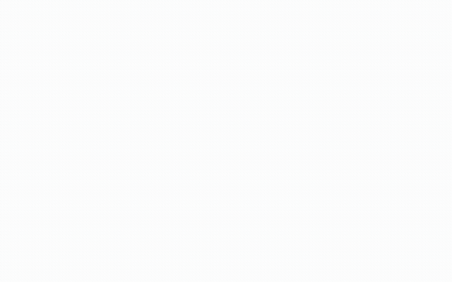

<div align="center">

# 👶 AtoCatch

**AI 기반 영유아 아토피 위험 신호 확인 · 피부 상태 분석 · 홈케어 서비스**

> 스마트폰 피부 사진 한 장과 간단한 설문만으로, 집에서도 아토피 위험 신호를 확인하고 관리한다

[](https://atocatch.streamlit.app/)




</div>

---

## 📌 프로젝트 소개

AtoCatch는 **“누구에게, 언제 필요한 서비스인가?”**라는 질문에서 출발했습니다. 아토피 피부염은 주로 생애 초기에 시작되는 특성이 있어, 조기에 위험 신호를 확인할 필요성이 큰 **영유아와 보호자**를 핵심 대상으로 정했습니다.

또한 발병 전의 환경·가족력과 이후 진단 여부를 시간에 따라 연결해 보기 위해, 같은 아동을 여러 시점에 걸쳐 추적한 **한국아동패널(PSKC)**을 설문 데이터로 선정했습니다. 이를 통해 발병 위험요인을 분석하고, 현재 피부 상태를 보는 이미지 모델과 함께 서비스로 연결했습니다.

> 💡 초기의 범용 피부 AI(`atocatch-skin-ai`)에서 영유아 아토피(`atocatch-pediatric-atopy-ai`)로 범위를 구체화한 이유도 같습니다. **서비스는 대상과 사용 시점이 분명해야 한다고 판단해, 조기 스크리닝의 필요성이 큰 영유아에 맞춰 데이터와 기능을 다시 설계했습니다.**

| 구분 | 내용 |
|---|---|
| 개발 기간 | 2026.05 · 약 1개월 |
| 팀 구성 | 3인 |
| 타깃 | 영유아(0~5세) 보호자 |
| 이미지 데이터 | AI Hub 합성 10,800장 + DermNet NZ 265장 |
| 설문 데이터 | 한국아동패널 1~10차, N=1,967명 |
| 이미지 모델 | EfficientNetV2-S (아토피 유무 + IGA 중증도) |
| 설문 모델 | Logistic Regression |
| 서비스 | Streamlit 멀티페이지 웹앱 + RAG 챗봇 |

**핵심 기능**

- **피부 상태 분석** — 스마트폰 사진으로 아토피 의심 여부와 중증도를 분석하고, Grad-CAM으로 모델이 주목한 피부 영역을 표시
- **설문 위험도 확인** — 부모 병력·환경 노출 등 11개 변수로 아토피 발병 위험을 저/중/고 3단계로 안내
- **홈케어 정보 제공** — 임상 가이드라인을 검색해 답변하는 RAG 챗봇과 분석 이력 기록

---

## 👩‍💻 담당 역할

3인 팀에서 **이미지 분류 모델 전체**와 **설문 데이터 선정·분석**을 담당했습니다.

| 구분 | 담당 내용 |
|---|---|
| 이미지 모델링 | 데이터 전처리, 아키텍처 비교, 학습·평가, Grad-CAM 기반 시각화 |
| 설문 데이터 | 한국아동패널 데이터 선정, 전처리·파생변수 설계, 위험요인 통계분석(단변량·다중공선성 검토·로지스틱 회귀) |

> 설문 위험도 모델의 학습·threshold 선정(Logistic Regression)은 팀원이 진행했습니다. 웹 서비스(Streamlit 앱 구현)는 다른 팀원이 담당했습니다.

---

## 📊 주요 결과

> 먼저 쉽게 보면, **이미지 모델은 실제 피부 사진에서도 약 80% 수준의 정확도와 AUC 0.839를 기록했고**, 설문 분석에서는 여러 위험요인을 확인했지만 **개인별 발병 예측력은 제한적**이었습니다.

### 이미지 분류 모델

| 태스크 | Accuracy | F1 | AUC | Sensitivity(민감도) |
|---|---:|---:|---:|---:|
| 아토피 유무 (DermNet holdout) | 79.6% | 80.9% | 0.839 | 88.5% |
| IGA 중증도 (내부 검증) | 83.9% | 83.7% | 0.876 | 90.6% |

※ DermNet holdout은 모델 선택과 threshold 설정에도 사용되어, 완전히 독립적인 test 성능은 아닙니다.

> 학습용 합성 이미지에서는 잘 맞았지만 실제 피부 사진에서는 성능이 크게 떨어졌습니다. 실제 피부 이미지를 일부 학습에 추가하고 데이터 분할 문제를 수정하면서, 현재 배포 모델은 DermNet holdout에서 **Accuracy 79.6%, AUC 0.839**를 기록했습니다.

### 설문 위험도 모델

| 지표 | 결과 |
|---|---:|
| Test AUC | 0.629 |
| Test Recall(민감도) | 0.7667 (threshold 0.12) |
| 핵심 위험 인자 (p<0.05) | 항생제 3회↑(OR 1.96) · 부모 아토피(1.72) · 부모 비염(1.39) · 실내 곰팡이(1.37) |

> 통계적으로 유의한 위험요인은 확인됐지만, **위험요인이 있다는 것과 개인의 발병을 정확히 예측하는 것은 다른 문제**였습니다. 사후 검증에서도 설문 정보만으로 개인 발병을 구분하는 데 한계가 있음을 확인했습니다.

<sub>AUC는 두 집단을 구분하는 능력을 나타내며 0.5에 가까울수록 무작위 수준, 1에 가까울수록 구분력이 높습니다. Sensitivity/Recall은 실제 아토피 사례를 놓치지 않는 비율입니다.</sub>

---

## 🌐 서비스 흐름

AtoCatch는 **발병 가능성을 보는 설문**과 **현재 피부 상태를 보는 이미지 분석**을 따로 제공합니다. 두 모델이 보는 정보가 다르기 때문에 하나의 점수로 억지로 합치지 않고, 보호자가 각각의 결과를 함께 참고하도록 설계했습니다.

| 1. 설문으로 위험요인 확인 | 2. 피부 사진 스캔 |
|:---:|:---:|
|  |  |
| **3. 분석 결과 확인** | **4. AI 챗봇에게 후속 관리 물어보기** |
|  |  |

> 로그인·홈·기록 화면은 전체 시연 GIF에서 확인할 수 있으며, README에는 서비스의 핵심 흐름을 보여주는 화면만 남겼습니다.

---

## 🔍 모델 검증과 의사결정

모델 성능 숫자만 남기기보다, **어떤 문제가 있었고 왜 방법을 바꿨는지**를 중심으로 정리했습니다.

### 1. 실제 피부 사진에서 성능이 떨어지는 문제를 발견

AI Hub 합성 이미지에서는 높은 성능이 나왔지만, 실제 피부 사진에서는 정확도가 **62.6%**까지 떨어졌습니다. 실제 DermNet 이미지를 일부 학습에 추가하자 **76.9%**로 개선됐고, 이후 데이터 분할 문제까지 수정한 현재 모델은 **79.6%, AUC 0.839**를 기록했습니다.

<details>
<summary>기술적 검증 과정 보기</summary>

- AI Hub 합성 이미지 내부 성능: 95.8%
- DermNet 실제 이미지 265장 평가: 62.6% → 합성/실사 간 domain gap 확인
- DermNet 157장을 학습에 추가하고 108장을 holdout으로 사용: 76.9%
- 이후 아래의 base-id 그룹 분할 문제를 수정해 재학습: holdout Accuracy 79.6%, AUC 0.839
- DermNet holdout 108장은 아키텍처 선택과 threshold 설정에도 사용돼 **완전히 독립적인 external test는 아닙니다.**

</details>

### 2. 비슷한 이미지가 train/test에 나뉘는 문제를 발견

배포 후 데이터를 다시 확인하면서 같은 base-id를 가진 여러 이미지가 서로 다른 split에 들어갈 수 있음을 발견했습니다. 같은 그룹의 이미지는 한 split에만 들어가도록 다시 나눈 뒤 모델을 재학습해 배포 모델을 교체했습니다.

<details>
<summary>base-id leakage 점검과 재학습 결과 보기</summary>

AI Hub 라벨 데이터의 `정면` 폴더에는 같은 base-id가 신체부위·병변 코드만 다르게 여러 장 존재했습니다. 실제 동일 환자라는 메타데이터는 없어 patient-level이라고 단정하지 않고 **base-id group-preserving split**이라고 표기했습니다.

기존 랜덤 분할에서는 전체 풀의 5.33%에 해당하는 그룹이 나뉘었고, 16개 그룹은 train과 test에 동시에 포함돼 직접적인 leakage가 있었습니다. 이를 `GroupShuffleSplit` 기반으로 수정했습니다.

| | 기존 랜덤 split | 그룹 보존 재학습 |
|---|---:|---:|
| DermNet holdout Acc | 80.6% | 79.6% |
| DermNet holdout AUC | 0.828 | **0.839** |
| DermNet holdout Sensitivity | 69.2% | **88.5%** |

동일 DermNet holdout에서는 leakage 수정 후에도 성능 저하가 관찰되지 않았고, AUC와 Sensitivity는 개선됐습니다.

- 점검: `check_aihub_subject_leakage.py`
- 재분할: `make_grouped_split.py`
- 재학습: `train_binary_grouped_final.py`
- 결과는 seed=42 1회 실행 기준으로, 다른 seed에서도 같은 경향이 유지되는지는 추가 검증이 필요합니다.

</details>

### 3. 설문에서 ‘미발병’으로 처리된 사람을 다시 확인

원본 학습 코드를 재현하는 과정에서, **추적이 끊겨 발병 여부를 확인할 수 없는 일부 아동이 기존 전처리에서 ‘미발병’으로 처리된 문제**를 발견했습니다. 이를 더 엄격하게 구분해 다시 분석하자 AUC가 낮아졌고, 제한된 설문 변수만으로 개인의 향후 발병을 예측하는 데 한계가 있음을 확인했습니다.

<details>
<summary>설문 outcome 재검증 과정과 수치 보기</summary>

배포된 원본 학습 스크립트(`train_final_service_model.py`)를 재실행해 기존 모델과 계수가 부동소수점 오차 수준으로 일치함을 확인했습니다. 즉, **배포 모델이 어떻게 만들어졌는지는 재현했지만 outcome 정의가 타당한지는 별도로 검토할 필요가 있었습니다.**

한국아동패널 공식 코드북과 대조한 결과, 8·9차 무응답까지 기존 전처리에서 미진단으로 처리되고 있었습니다. 추적 상태를 엄격히 재구성하면 기존 Y=0 1,666명 중 **430명(25.8%)은 follow-up 정보가 충분하지 않은 상태**였습니다.

| 분석 | N | AUC |
|---|---:|---:|
| 배포 서비스 모델 (Original) | 1,967 | 0.629 |
| 7~10차 엄격 추적 검토 | 1,537 | 0.555 |
| 9차 명시적 응답만 사용 | 1,306 | 0.575 |

AUC 감소에는 outcome 정의 수정뿐 아니라 표본 수·발생률·대상자 구성 변화가 함께 영향을 줄 수 있어, 기존 모델의 성능이 잘못된 라벨 때문에 높았다고 단정하지는 않습니다.

- 재분석: `training/survey_model/train_corrected_outcome_model.py`
- 9차는 `예/아니오`가 명시적이어서 가장 명확한 사후 분석으로 보았습니다.
- 추적이 끊긴 430명은 다른 예측변수도 결측이 많았지만, 탈락이 무작위라는 것은 입증하지 못해 attrition bias 가능성이 남아 있습니다.
- 이 분석은 **방법론 검증 목적이며 실제 배포 모델에는 반영하지 않았습니다.**

</details>

### 4. 발병 시점까지 보는 생존분석도 시도했지만 최종 모델에는 사용하지 않음

Kaplan-Meier와 Cox 모델도 탐색했지만, 분석 방법에 따라 유의한 변수가 달라져 일관된 결론을 내리기 어려웠습니다. 따라서 서비스에는 상대적으로 결과가 안정적이었던 로지스틱 회귀를 사용하고, 생존분석 코드는 참고용으로 남겼습니다.

<details>
<summary>생존분석을 미채택한 이유 보기</summary>

같은 데이터로 Kaplan-Meier/Cox 비례위험모델을 시도했지만, 변수별로 Log-rank → Cox 단변량 → Cox 다변량으로 갈수록 유의성이 흔들렸습니다. 반면 로지스틱 회귀에서는 4개 핵심 위험요인이 동일 데이터에서 p<0.05로 확인돼 서비스용 모델로 채택했습니다.

관련 코드는 `training/survival_analysis/`에 보존합니다.

</details>

---

## 🛠️ 기술 스택

Python 3.10+ · PyTorch · timm (EfficientNetV2-S) · scikit-learn · Streamlit · OpenAI API + RAG · Grad-CAM · Plotly

## 📁 데이터

| 데이터 | 출처 | 규모 | 용도 |
|--------|------|------|------|
| 아토피·피부 이미지 | AI Hub (한국지능정보사회진흥원) | 10,800장 (6 클래스 × 1,800) | 이미지 분류 모델 학습 |
| 실제 피부 이미지 | DermNet NZ (직접 크롤링) | 265장 | Holdout 평가·도메인 갭 보완 |
| 영유아 패널 데이터 | 한국아동패널 (1~10차) | N=1,967명 | 설문 위험도 모델 학습 |

> ⚠️ AI Hub 데이터는 라이선스 제한으로 레포지토리에 포함되지 않습니다. DermNet NZ 크롤러는 `training/image_classification/data_crawl_dermnet.py`에서 확인할 수 있습니다(DermNet NZ 저작권 하에 있으므로 재사용 시 출처를 명시하세요).

---

<details>
<summary><b>🗂️ 프로젝트 구조</b></summary>

```
AtoCatch/
├── app/                              # Streamlit 웹 앱 (streamlit run app/app_main.py 로만 실행)
│   ├── app_main.py                   # 메인 앱 (로그인·회원가입·홈·설문·이미지 분석·챗봇·기록 전부 포함)
│   ├── gradcam_module.py             # Grad-CAM 시각화 모듈
│   ├── rag_engine.py                 # RAG 챗봇 엔진
│   ├── model_config.json             # 현재 배포 아토피 유무 모델의 threshold·성능 메타데이터
│   ├── model_config2.json            # 중증도 모델 메타데이터
│   ├── atopy_service_model.joblib    # 설문 위험도 모델 (학습된 결과물)
│   ├── best_model.pth / best_iga_model.pth  # 이미지 모델 가중치 (레포에 직접 커밋)
│   ├── requirements.txt
│   ├── design/                       # UI 이미지 에셋
│   ├── screenshots/                  # 앱 스크린샷
│   └── survey_model/                 # 설문 모델 계수·학습 데이터
│
└── training/                         # 모델 학습 코드
    ├── image_classification/
    │   ├── train_binary.py               # 아토피 유무 이진 분류 학습 (v1, 합성데이터만)
    │   ├── train_binary_dermnet_mix_v2.py # 이진 분류 학습 v2 (DermNet 믹싱, efficientnet_b0)
    │   ├── eval_comparison.py            # 5개 아키텍처 비교 실험 (아키텍처 선정용)
    │   ├── eval_binary_legacy_holdout.py # (구) DermNet 60/40 holdout 재평가 코드 — 참고용
    │   ├── make_grouped_split.py         # base-id 그룹 보존 split 유틸 (leakage 수정용)
    │   ├── train_binary_grouped_final.py # 현재 배포 모델(best_model.pth) 실제 학습 스크립트
    │   ├── check_aihub_subject_leakage.py # AI Hub base-id 중복(leakage) 점검
    │   ├── predict.py                    # 단일 이미지 추론 (현재 배포 모델 사용)
    │   ├── data_setup.py / data_split.py / data_split_raw.py / data_prepare.py / data_matching.py
    │   ├── utils_gradcam.py              # Grad-CAM 모듈
    │   ├── utils_threshold.py            # 임계값 최적화 (Youden's J)
    │   └── data_crawl_dermnet.py         # DermNet NZ 이미지 크롤러
    ├── survey_model/
    │   ├── train_features.py             # 설문 피처 가공 (모델 학습은 하지 않음)
    │   ├── train_xgboost.py              # XGBoost 비교 실험
    │   ├── eval_logistic_v2.py           # 로지스틱 회귀 v1/v2 변수셋 비교
    │   ├── train_final_service_model.py  # atopy_service_model.joblib 원본 학습 스크립트 (bit-exact 검증됨)
    │   ├── train_corrected_outcome_model.py # 사후 outcome 감사용 재학습 (서비스 미적용)
    │   ├── data_merge.py / data_build_ad_history.py
    │   └── eval_univariate.py
    └── survival_analysis/                # 생존분석 (탐색 후 미채택, 참고용)
        ├── eval_survival_v1.py / eval_survival_v2.py / eval_survival_v3_early_predictors.py
        └── results/
```

> ⚠️ IGA 중증도 모델(`best_iga_model.pth`)을 실제로 학습한 스크립트는 어디에도 없습니다. 확인된 것은 `tf_efficientnetv2_s(num_classes=2)`에 strict load로 정상 로드된다는 아키텍처 일치뿐이고, optimizer·split·seed 등 학습 설정은 불명이라 추정해서 만든 코드는 추가하지 않았습니다(아키텍처 추정 재현 ≠ 실제 재현이기 때문).

</details>

<details>
<summary><b>⚙️ 실행 방법</b></summary>

`best_model.pth`, `best_iga_model.pth` 모두 `app/`에 레포와 함께 커밋되어 있어 별도 다운로드가 필요 없습니다(각 77.8MB, GitHub 100MB 리밋 이내).

```bash
cd app
pip install -r requirements.txt
```

`app/` 폴더 안에 `.env` 파일 생성:
```env
OPENAI_API_KEY=your_openai_api_key
```

```bash
streamlit run app/app_main.py
```

</details>

<details>
<summary><b>🧹 프로젝트 종료 후 리팩터링</b></summary>

포트폴리오 정리 과정에서 저장소와 서비스 코드를 다시 검증해 다음을 수정했습니다.

- **설문 위험도 예측 인코딩 반전 버그 수정**: 8개 설문 항목의 예/아니오가 학습 데이터와 반대로 모델에 들어가던 버그, 항생제 응답 카테고리 off-by-one — 실제 서비스 예측 결과에 영향 있던 버그라 실행 테스트로 수정 확인
- 파일명과 실제 내용이 다른 스크립트 다수 정리·개명, 죽은 코드(안 쓰는 로그인/회원가입 모듈, 구버전 앱 스냅샷 등) 삭제
- 원본 학습 스크립트를 찾아 배포된 설문 모델과 계수 bit-exact 일치 검증, 사업계획서의 Isotonic Calibration 오기재 정정
- 모델 가중치를 Google Drive 런타임 다운로드 방식에서 레포 직접 커밋으로 전환 (외부 의존성 제거)
- AI Hub base-id leakage 발견 → grouped split 재학습 → 배포 모델 교체 (위 "모델 검증과 의사결정" 참고)
- 설문 모델 outcome(Y) 정의를 공식 코드북과 대조해 방법론적 한계 발견·투명하게 공개 (위 참고)
- 재학습 스크립트의 출력 경로 등 프로젝트 내부 경로를 상대경로로 정리 (AI Hub/DermNet 원본처럼 레포에 없는 외부 대용량 데이터 루트는 다른 학습 스크립트들과 동일하게 사용자가 직접 지정하는 절대경로로 유지)
- **Grad-CAM 시각화 오류 발견 → Grad-CAM++로 교체**: 실제 사진으로 확인해보니 바닐라 Grad-CAM이 병변이 아닌 정상 피부에 핫스팟을 찍는 경우가 반복돼, 같은 타겟 레이어를 유지한 채 채널별 2차 미분 가중치를 쓰는 Grad-CAM++로 교체(재학습 없이 시각화 가중치 공식만 변경). 실행 테스트로 개선 확인, 다만 완전히 해결된 것은 아님(아래 "한계" 참고)

</details>

---

## ⚠️ 한계

- **설문 모델**: 추적이 중단된 일부 아동이 기존 outcome에서 미발병으로 처리된 문제가 있었고, 엄격한 기준으로 다시 분석하면 AUC가 낮아집니다. 사후 재분석은 방법론 검증용이며 현재 배포 모델에는 반영하지 않았습니다.
- 추적이 중단된 사람이 무작위로 빠졌다고 입증할 수 없어 **attrition bias(추적 탈락에 따른 편향)** 가능성이 남아 있습니다.
- **이미지 모델**: DermNet holdout 108장을 아키텍처 선택·threshold 설정·성능 보고에 반복 사용했기 때문에, 현재 수치는 완전히 독립적인 외부 테스트 성능이 아닙니다.
- base-id 그룹 보존 재학습은 seed=42 1회 실행 기준으로, 다른 seed에서도 같은 결과가 유지되는지는 추가 확인이 필요합니다.
- **Grad-CAM**: 판단 근거를 보여주는 참고용 시각화이며, 실제 병변 위치를 항상 정확히 짚어주는 것을 보장하지 않습니다. 바닐라 Grad-CAM에서 병변과 어긋난 활성화가 자주 관찰돼 Grad-CAM++로 교체해 개선했지만, 일부 이미지에서는 여전히 정상 피부에 활성화가 남습니다.

---

## ⚠️ 사용 안내

본 서비스의 결과는 AI 예측 수치이며, **의사의 진단이나 치료를 대체할 수 없습니다.** 정확한 진단과 치료는 소아청소년과 또는 피부과 전문의와 상담하시기 바랍니다.
